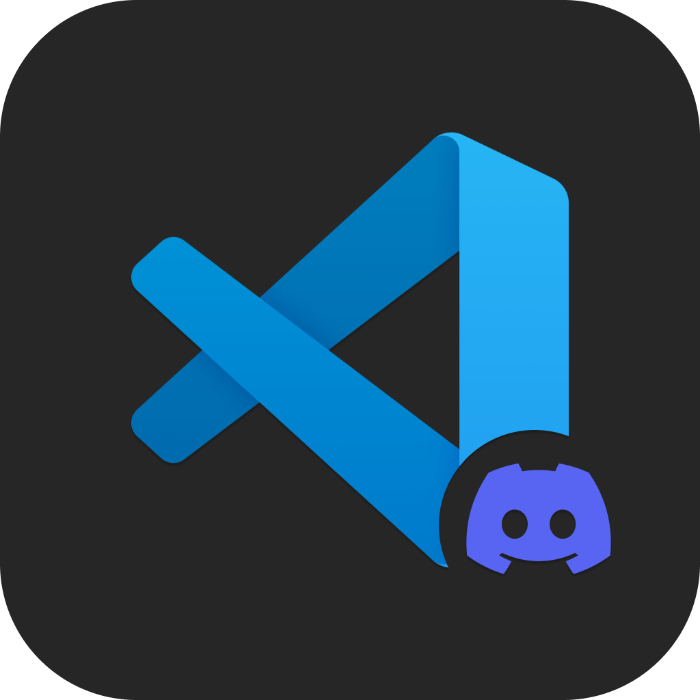

    

        <h1>2.2.0 VSCode-Discord-RPC</h1>
    

    
     
    
      
    

        
        
        
        
    

    

        
        
        
        
        
    

## About the extension

Connects to discord and displays custom RPC.

IF ANY ISSUES/BUGS ACCURE, PLEASE REPORT THEM.

### [Versioning](https://semver.org/#semantic-versioning-200)

## Features

-   Caching discords IPC pipe path for faster loading
-   Working on, Shows in the RPC what are you currently working on
-   Language icon display, displays the language icon in the RPC
-   Time elapsed, self explanatory
-   Problems, Problems in file currently worked on
-   Automatic restart when discord disconnects
-   Issues reporter

## Requirements

-   Discord installed
-   [Activity enabled in discord](#activity-setting-in-discord)
-   [WebSocket](https://www.npmjs.com/package/ws)
-   [glob](https://www.npmjs.com/package/glob)

### Activity setting in discord

First go to settings, then scroll down to category `ACTIVITY SETTINGS`. After that click on `Activity Privacy` and enable `Share detected activities with others`.
If the setting is disabled the presence wont show up on your discord profile.

## Extension Settings

| String to format | Description                  |
| ---------------- | ---------------------------- |
| `$(fileName)`    | file's name                  |
| `$(fileType)`    | file's type                  |
| `$(workspace)`   | workspace's name             |
| `$(problems)`    | problems in file             |
| `$(line)`        | current cursor line position |
| `$(col)`         | cursor column position       |

### Show Time

Show elapsed time in custom RPC

### Update Time Interval

Time interval for updates in seconds (default: 15).

### Editing > Show Language Icon

`vscode-discord-rpc.showTime`

Shows a icon for the language of a file currently worked on.

### Editing > Details

`vscode-discord-rpc.editing.details`

Discord's RPC details field (first field).

### Editing > State

`vscode-discord-rpc.editing.state`

Discord's RPC state field (second field).

### Editing > Icon Text

`vscode-discord-rpc.editing.iconText`

Text of an icon when hovered over in RPC.

### Idle > Details

`vscode-discord-rpc.idle.details`

Same as `vscode-discord-rpc.editing.details` but when not editing a file (`$(workspace)` only avaiable).

### Idle > State

`vscode-discord-rpc.idle.state`

Same as `vscode-discord-rpc.editing.state`

### Idle > Icon Text

`vscode-discord-rpc.idle.iconText`

Same as `vscode-discord-rpc.editing.iconText`

## Known Issues

None at the moment.

## Release Notes

More size reduction, added commands and events handlers.

